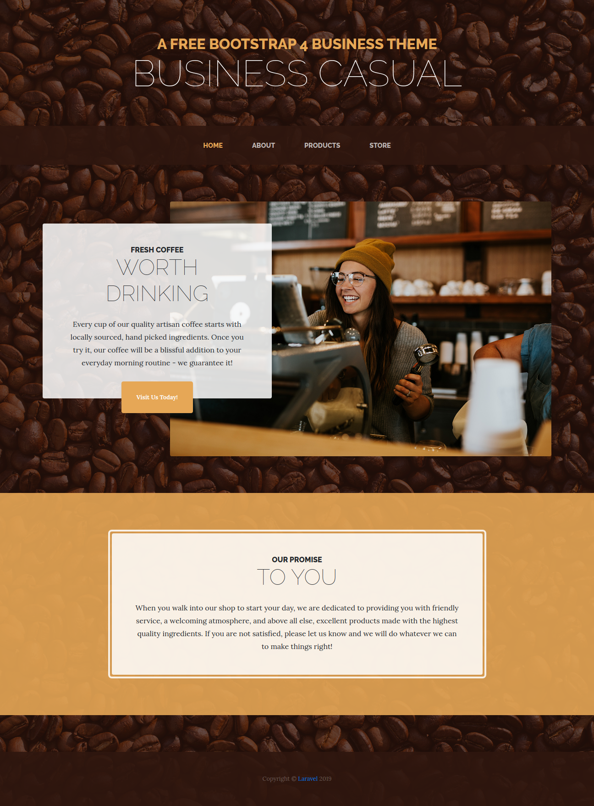
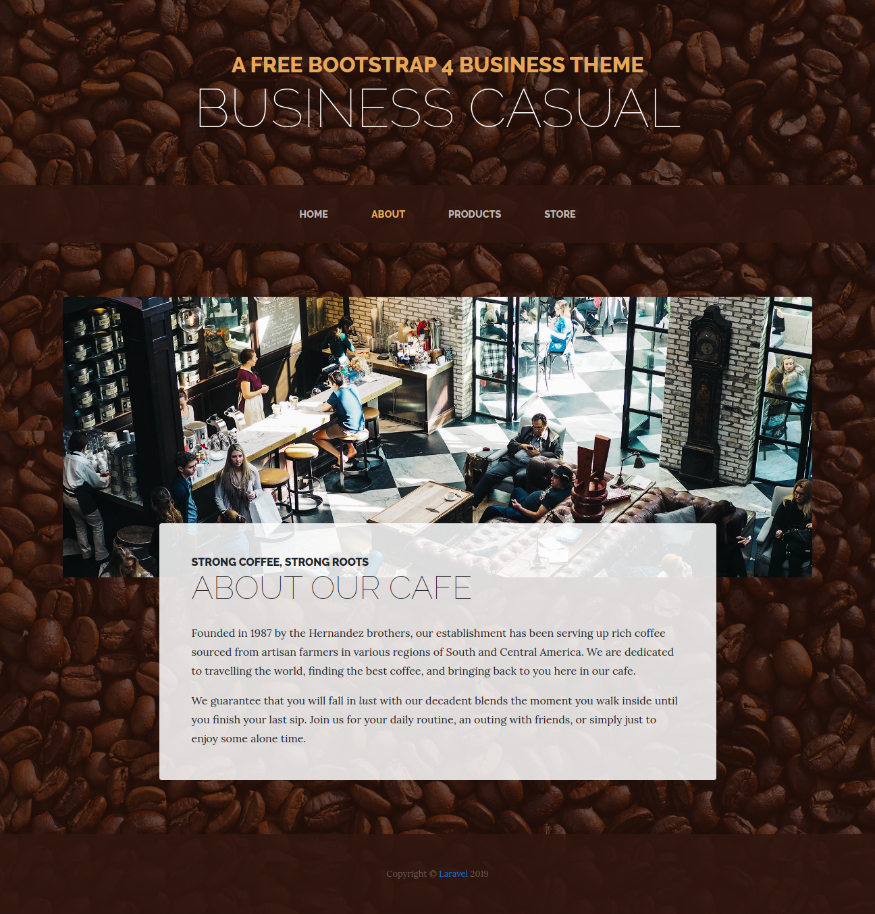
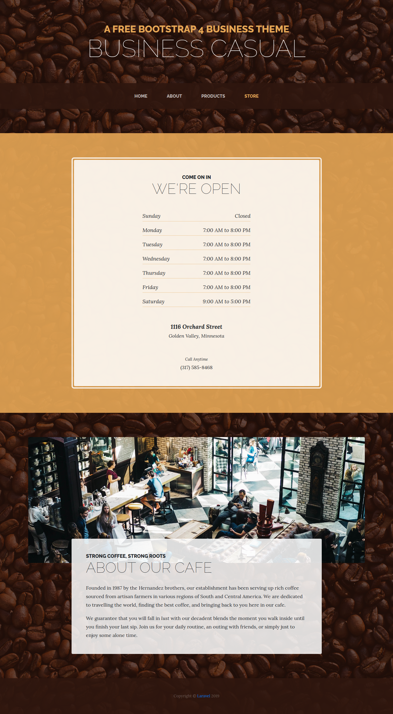

# Laravel Vue Coffee Shop Single Page Application

#### Home Page

    

#### Contact Page

    

#### Products Page

    

#### Store Page

        

## Setup Instructions

1. `git clone https://github.com/tridibdawn/Coffee-Shop-Laravel-Vue-SPA.git`
2. `cd <your-folder-name>`
3. copy `.env.example` to `.env`
4. insert database credentials.
5. Run `composer install`
6. `php artisan key:generate`
7. `npm install`
8. `npm run dev`
9. `npm run build`
10. `php artisan serve`
11. visit `127.0.0.1:8000`
